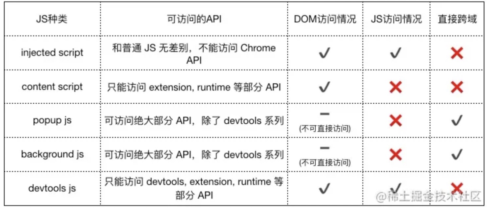
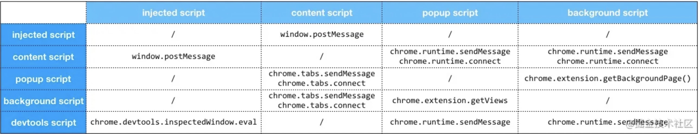
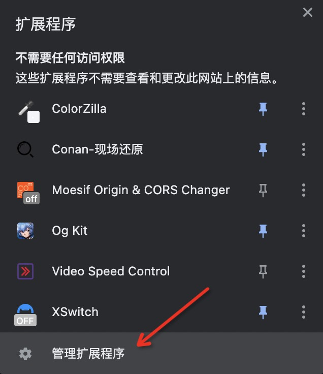
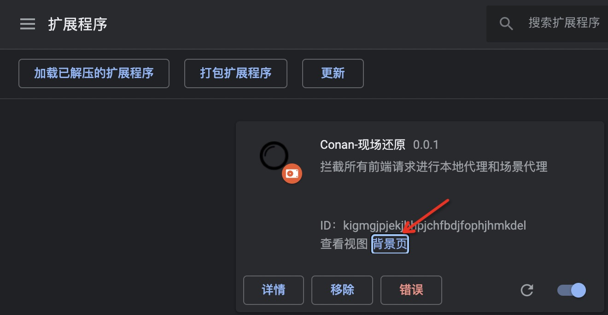

Chrome浏览器插件中的content、background、popup是三个相对独立的模块，它们不仅有不同的调试方式，还各自之间遵循着不同的通信协议。

## 通信



### popup和background之间的通信

#### background => popup
background.js 添加代码:
```js
function toPopup() {
    alert('to popup!')
}
```

popup.js 添加代码：

```js
const bg = chrome.extension.getBackgroundPage()
document.getElementById('rBgInfo').onclick = function() {
    bg.toPopup()
}
```

#### popup => background 

popup.js 添加代码：
```js
// 使用长连接
let port = chrome.extension.connect({
    name: 'popup-name'
})

// 使用postMs 发送信息
port.postMessage('给 background 传递信息~')

// 接收信息
port.onMessage.addListener(msg => {
    console.log('接收的信息：', msg)
})
```

在background.js 增加如下代码：
```js
// 获取所有 tab
const pups = chrome.extension.getViews({
    type: 'popup'
}) || []

// 输出第一个使用插件页面的url
if (pups.length) {
    console.log(pups[0].location.href)
}
```

### popup和content之间的通信

#### content => popup

content.js添加代码：
```js
// Chrome提供的大部分API是不支持在content_scripts中运行
// sendMessage onMessage 是可以使用
chrome.runtime.sendMessage({
    info: "我是 content.js"
}, res => {
    // 答复
    alert(res)
})
```

popup 添加代码：
```js
chrome.runtime.onMessage.addListener((req, sender, sendResponse) => {
    sendResponse('我收到了你的来信')
    console.log('接收了来自 content.js的消息', req.info)
})
```

#### popup => content

popup添加代码：
```js
// popup ---> content
chrome.tabs.query({
    active: true,
    currentWindow: true
}, (tabs) => {
    let message = {
        info: '来自popup的信息'
    }
    chrome.tabs.sendMessage(tabs[0].id, message, res => {
        console.log('popup=>content')
        console.log(res)
    })
})
```

content添加代码：
```js
// get popup2content info
chrome.runtime.onMessage.addListener((request, sender, sendResponse) => {
    console.log(request.info)
    sendResponse('我收到了你的信息，popup~')
})
```

### 总结
连接方式：

长连接： chrome.tabs.connect 和 chrome.runtime.connect

短连接： chrome.tabs.sendMessage




## 调试

### popup

popup调试：直接点开插件图标触发插件页面，检查插件页面打开控制态即可

### background

background调试：

1. 开发模式下打开插件列表



2. 找到对应插件打开背景页



### content

content调试：由于content是直接注入到对应的tab页中的，因此和当前激活的tab共用一个控制台。
