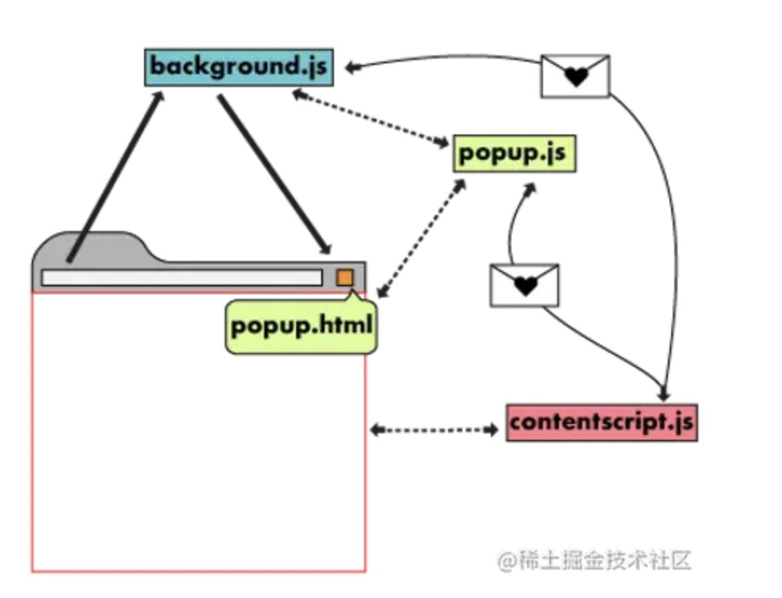

## 功能
- 接口控制
- 书签控制
- 下载控制
- 窗口控制
- 标签控制
- 网络请求控制，各类事件监听
- 自定义原生菜单
- 完善的通信机制

## 主要结构



### manifest.json

配置文件，类似于package.json，配置插件版本、名称、描述等信息

```json
{
    "name": "chrome extension",
    "version": "1.0.0",
    "manifest_version": 2,
    "description": "A little chrome extension demo"
}
```

### background

后台，相当于一个常驻的页面，它的生命周期是插件中所有类型页面中最长的，它随着浏览器的打开而打开，随着浏览器的关闭而关闭，所以通常把需要一直运行的、启动就运行的、全局的代码放在background里面。

background的权限非常高，几乎可以调用所有的Chrome扩展API（除了devtools），而且它可以无限制跨域，也就是可以跨域访问任何网站而无需要求对方设置CORS

### content-scripts/injected script
注入到页面中的脚本，不过Content Script能访问DOM的内容，但却不能访问页面原本的脚本（我是说直接访问不行），反之，页面原本的脚本也不能直接访问Content Script。
但是它和页面其他的脚本是隔离的，访问不到其他脚本定义的变量、函数等，相当于运行在单独的沙盒里。content script 可以调用有限的 chrome 插件 API，网络请求收到同源策略限制。

content 可以向页面中注入<script>，由此给页面提供 SDK 等功能，注入的脚本和页面自己的脚本一样，都无法和 content 直接通信。

注意：注入的资源要先在 menifest 的 web_accessible_resources 字段中声明。
### popup

点击插件图标后出现的弹框，失焦就关闭，与content一样，一个tab对应一个popup


